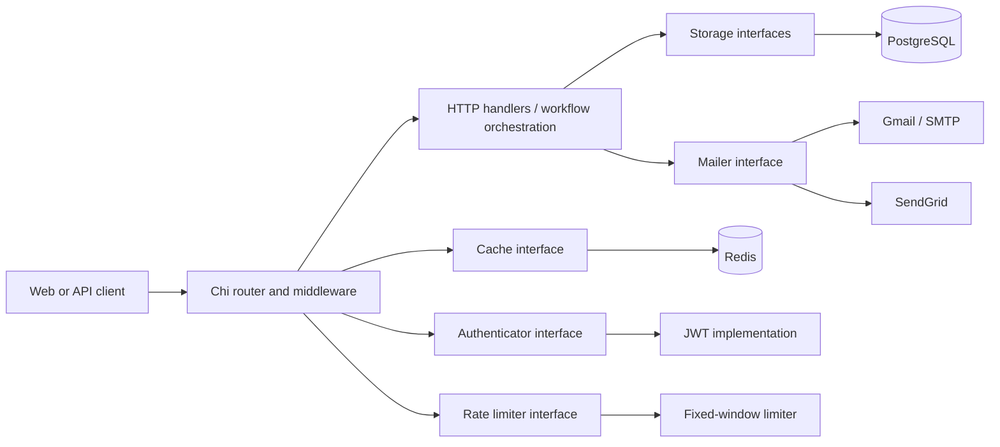

# Psocial API

> A production-minded social backend built to make my engineering decisions visible.

[](https://github.com/peterintech/psocial/actions/workflows/audit.yaml)
[](https://go.dev/)
[](https://www.postgresql.org/)
[](https://redis.io/)

Psocial is a REST API for a small social network: users register and activate their accounts, authenticate with JWTs, publish and discuss posts, follow people, and receive a personalized feed.

I built it as a backend engineering portfolio project. The interesting part is how the system handles concurrent writes, multi-step workflows, authorization, replaceable infrastructure, abusive traffic, database access patterns, observability, and failure.

## What this project demonstrates

- Interface-driven boundaries that make PostgreSQL, Redis, authentication, rate limiting, and email delivery independently replaceable and testable.
- Optimistic concurrency control that prevents two requests from silently overwriting the same post.
- Transactional user invitation and activation workflows, plus a compensating action when external email delivery fails.
- Cache-aside user reads with an optional Redis adapter and a one-minute TTL.
- Database-backed hierarchical RBAC for owners, moderators, and administrators.
- Query-specific PostgreSQL indexes for text search, tags, joins, and frequently accessed identifiers.
- JWT authentication, bcrypt password hashing, expiring hashed activation tokens, request validation, and protected runtime metrics.
- A fixed-window per-IP rate limiter chosen deliberately for a simple single-instance implementation.
- CI that verifies modules, builds, vets, runs Staticcheck, and executes the test suite with the race detector.

## Architecture at a glance



The HTTP layer owns request parsing and workflow orchestration. Storage, caching, authentication, mail, and rate limiting sit behind narrow interfaces. Go's `internal/` boundary prevents consumers outside this module from importing implementation packages directly.

I intentionally did not add a service layer just to satisfy an architectural diagram. At this size, handlers can orchestrate the use cases without hiding business logic behind pass-through methods. The interfaces still provide a clear seam for extracting a service layer when workflows become complex enough to justify one.

## Design decisions and trade-offs

### 1. Prevent lost updates instead of accepting last-write-wins

During concurrent update testing with [`scripts/test_concurrency.go`](scripts/test_concurrency.go), two requests could read the same post state and both attempt to write it. A normal update would allow the last request to silently overwrite the first.

Every post therefore carries a `version`. Updates use a compare-and-swap-style query:

```sql
UPDATE posts
SET content = $1,
    title = $2,
    tags = $3,
    updated_at = CURRENT_TIMESTAMP,
    version = version + 1
WHERE id = $4 AND version = $5
RETURNING updated_at, version;
```

Only the request holding the current version can update the row. The winner increments the version; the stale writer affects no row and returns an error instead of destroying a newer change. This is optimistic concurrency control: no long-lived lock is held while a user edits, but conflicting writes are still detected.

When the conditional update matches no row, the store now returns a dedicated version-conflict error. The HTTP layer maps it to `409 Conflict`, giving clients a truthful signal to reload the post and reconcile their changes. A post that is missing when the request is initially resolved still returns `404 Not Found`.

**Trade-off:** optimistic concurrency avoids holding database locks while someone edits, but it moves conflict resolution to the caller. The current API reads the post's version at the start of the update request, so it prevents overlapping server requests from overwriting each other; it cannot tell that a user submitted an edit based on an older copy previously loaded into the UI. The next refinement would expose the version as an `ETag` and require `If-Match` on `PATCH` (or accept an explicit expected version), allowing the server to reject stale client representations too. That stronger contract requires clients to retain versions and deliberately offer reload, merge, or retry behavior after a conflict.

### 2. Keep database invariants atomic; compensate across system boundaries

Registration spans two database writes - a user and an invitation. `CreateAndInvite` wraps both operations in one SQL transaction, so either both records commit or neither does.

Activation is also transactional:

1. Find a valid, unexpired invitation.
2. activate the user.
3. delete the one-time invitation.

Email is different: an SMTP provider cannot participate in the PostgreSQL transaction. If delivery fails after the database transaction commits, the handler performs a compensating action and deletes the newly created user. This small Saga-style workflow prevents an unreachable inactive account from being left behind.

**Trade-off:** synchronous email keeps the workflow understandable but couples registration latency to the provider. At higher volume I would replace the compensating delete with a transactional outbox, an asynchronous worker, idempotency keys, and observable retries.

### 3. Depend on capabilities, not vendors

The application depends on a `mailer.Client`, not directly on SendGrid or SMTP. When SendGrid became unreliable during development, I added a standard-library SMTP implementation and selected the provider through `MAIL_PROVIDER`; the registration workflow stayed independent of the vendor.

The same pattern is used for storage, cache, token authentication, and rate limiting. This is dependency inversion in practical terms: core workflows ask for capabilities, and startup code supplies concrete adapters.

That separation also keeps tests fast. Delivery failures, rollback behavior, provider selection, template rendering, retries, and SMTP message construction can be tested without contacting Gmail.

### 4. Cache the read path that earns it

User records are read during authentication and authorization, making them a high-value cache target. Psocial uses cache-aside reads:

1. Look up `user-{id}` in Redis.
2. On a miss, fetch the user from PostgreSQL.
3. cache the result for one minute.
4. return the same domain model to the caller.

Redis is an optional adapter controlled by `REDIS_ENABLED`. Disabling it routes reads directly to PostgreSQL without changing handlers or the storage implementation.

#### Local benchmark

I used the same authenticated user lookup with 10 concurrent connections for five seconds:

```bash
npx autocannon http://localhost:8080/v1/users/409 \
  --connections 10 \
  --duration 5 \
  -H "Authorization: Bearer <token>"
```

| Scenario       |   p2.5 |    p50 |    p97.5 |      p99 |   Average |      Max |
| -------------- | -----: | -----: | -------: | -------: | --------: | -------: |
| Redis disabled | 599 ms | 614 ms | 1,961 ms | 1,979 ms | 820.52 ms | 1,979 ms |
| Redis enabled  |   1 ms |   3 ms |     8 ms |    10 ms |   4.51 ms | 1,478 ms |

In this local run, the warm-cache average was approximately **182× faster**, while median latency moved from 614 ms to 3 ms. The 1,478 ms maximum in the cached run is also a reminder to inspect tail behavior rather than reporting only averages.

These numbers are directional, not a production capacity claim: this was a short local benchmark, not a controlled distributed load test.

### 5. Add indexes for observed query shapes

Migration [`007_add_indexes.sql`](cmd/migrate/migrations/007_add_indexes.sql) matches indexes to the application's access patterns:

| Index                             | Why it exists                                                      |
| --------------------------------- | ------------------------------------------------------------------ |
| GIN trigram on `posts.title`      | Supports partial, case-insensitive feed search.                    |
| GIN trigram on `comments.content` | Prepares comment text search without sequential scanning at scale. |
| GIN on `posts.tags`               | Supports PostgreSQL array containment filters.                     |
| B-tree on `users.username`        | Speeds username lookup and complements uniqueness enforcement.     |
| B-tree on `posts.user_id`         | Supports author and feed joins.                                    |
| B-tree on `comments.post_id`      | Supports loading and counting comments for posts.                  |

I chose indexes from query behavior rather than adding them to every column. Indexes improve reads but consume storage and add write amplification, so each one should continue to justify itself through `EXPLAIN ANALYZE` and production query telemetry.

### 6. Use database-backed RBAC with ownership as the first rule

Roles live in PostgreSQL with numeric precedence:

| Role      |         Own posts | Update another user's post | Delete another user's post |
| --------- | ----------------: | -------------------------: | -------------------------: |
| User      | Update and delete |                         No |                         No |
| Moderator | Update and delete |                        Yes |                         No |
| Admin     | Update and delete |                        Yes |                        Yes |

The middleware first checks ownership, then consults role precedence only when the actor does not own the post. Authorization policy is therefore centralized instead of duplicated across handlers, and role levels can evolve without hard-coding a list of privileged usernames.

### 7. Choose the simplest rate limiter that meets the current threat model

The API applies a mutex-protected, per-IP fixed-window limiter before route handling. I considered sliding windows, token buckets, and leaky buckets algorithm, but selected fixed window because it provides constant-time accounting and a small implementation surface for the current single-instance application.

**Known limits:** bursts can occur at window boundaries, memory is process-local, and client IP needs trusted-proxy configuration after deployment. For horizontal scaling, I would move counters and atomic expiry into Redis and choose token bucket or sliding-window algorithm based on product traffic.

### 8. Treat security and operability as application features

- Passwords are hashed with bcrypt and never serialized.
- JWT validation requires expiration, issuer, audience, and the expected HMAC algorithm.
- Only activated users can obtain application tokens.
- Activation tokens are hashed before storage and expire after a certain duration.
- Public profile responses omit email; private account data uses `/users/me`.
- Resource owners bypass role escalation checks, while cross-user mutations require sufficient role precedence.
- Runtime metrics are exposed through `expvar` and protected with Basic authentication.
- JSON bodies are size-limited, unknown fields are rejected, and payloads are validated before persistence.
- Database queries use bounded contexts, the HTTP server defines read/write/idle timeouts, and shutdown is graceful.
- Duplicate PostgreSQL constraints are translated into domain errors instead of leaking raw driver messages.

A credential endpoint should return the same `401 Unauthorized` response for an unknown account and a wrong password so it cannot become an email-enumeration oracle. The wrong-password branch already follows this rule; normalizing the unknown-email branch is a current hardening item.

## Feed behavior

`GET /v1/users/feed` returns the authenticated user's posts plus posts from accounts they follow. The query also:

- joins author usernames;
- counts comments;
- filters title and content with case-insensitive search;
- filters PostgreSQL tag arrays;
- supports validated ascending or descending order;
- applies bounded limit/offset pagination.

The authenticated user comes from JWT middleware and request context - the feed does not trust a caller-supplied user ID.

## API surface

All routes use the `/v1` prefix.

| Method   | Endpoint                       | Authentication       | Purpose                                          |
| -------- | ------------------------------ | -------------------- | ------------------------------------------------ |
| `GET`    | `/health`                      | Public               | Service health, environment, and version.        |
| `GET`    | `/metrics`                     | Basic Auth           | Protected Go runtime/application metrics.        |
| `POST`   | `/auth/register`               | Public               | Create a user, invitation, and activation email. |
| `POST`   | `/auth/token`                  | Public               | Exchange activated-user credentials for a JWT.   |
| `PUT`    | `/users/activate/{token}`      | Public               | Consume an unexpired activation token.           |
| `GET`    | `/users/me`                    | JWT                  | Return private account data.                     |
| `GET`    | `/users/{userID}`              | JWT                  | Return a privacy-safe public profile.            |
| `GET`    | `/users/{userID}/relationship` | JWT                  | Return viewer-relative follow status.            |
| `PUT`    | `/users/{userID}/follow`       | JWT                  | Follow a user.                                   |
| `PUT`    | `/users/{userID}/unfollow`     | JWT                  | Unfollow a user.                                 |
| `GET`    | `/users/feed`                  | JWT                  | Return the personalized feed.                    |
| `POST`   | `/posts`                       | JWT                  | Create a post.                                   |
| `GET`    | `/posts/{postID}`              | JWT                  | Return a post with comments.                     |
| `PATCH`  | `/posts/{postID}`              | JWT + ownership/RBAC | Update a post with optimistic concurrency.       |
| `DELETE` | `/posts/{postID}`              | JWT + ownership/RBAC | Delete a post.                                   |
| `POST`   | `/posts/{postID}/comments`     | JWT                  | Comment as the authenticated user.               |

Interactive Swagger documentation is served at:

```text
http://localhost:8080/v1/swagger/index.html
```

## Project structure

```text
cmd/api/                 HTTP transport, middleware, configuration, startup
cmd/migrate/migrations/  Versioned PostgreSQL schema migrations
cmd/migrate/seed/        Development seed command
internal/auth/           Authentication interface and JWT adapter
internal/store/          PostgreSQL models, interfaces, and repositories
internal/store/cache/    Optional Redis cache adapter
internal/mailer/         Provider-neutral templates, SMTP, and SendGrid
internal/ratelimiter/    Limiter interface and fixed-window implementation
scripts/                 Database and concurrency test utilities
docs/                    Generated Swagger specification
```

The dependencies point inward through interfaces. Vendor-specific setup is concentrated in adapters and application startup; handlers do not construct Redis, PostgreSQL, JWT, or email clients.

## Running locally

### Prerequisites

- Go `1.26.6`
- Docker and Docker Compose
- [Goose](https://github.com/pressly/goose) for migrations
- [Air](https://github.com/air-verse/air) if you want live reload

### 1. Start backing services

```bash
docker compose up -d
```

Docker Compose exposes PostgreSQL on host port `5433` and Redis on host port `6380`. Ensure the values in your local `.env` match those ports.

### 2. Configure the application

```powershell
.env.example .env
```

Set a strong `JWT_SECRET`, local database credentials, and either SMTP or SendGrid credentials. Never commit `.env`.

For Gmail SMTP, enable two-step verification and use an App Password:

```env
MAIL_PROVIDER=smtp
MAIL_FROM_NAME=Psocial
MAIL_FROM_EMAIL=you@gmail.com
SMTP_HOST=smtp.gmail.com
SMTP_PORT=587
SMTP_USERNAME=you@gmail.com
SMTP_PASSWORD=your-app-password
```

### 3. Apply migrations

```powershell
goose -dir .\cmd\migrate\migrations postgres $env:DB_ADDR up
```

### 4. Run the API

```powershell
go run ./cmd/api
```

Or use live reload:

```powershell
air
```

Then verify the service:

```powershell
http://localhost:8080/v1/health
```

## Testing and quality gates

```bash
go test ./...
go test -race ./...
go vet ./...
```

The real SMTP integration test is opt-in so a normal test run never sends email. Unit tests replace external delivery with test doubles and cover configuration, message construction, retries, cancellation, template escaping, provider selection, and registration rollback.

The GitHub Actions audit additionally verifies modules, builds every package, runs Staticcheck, and enables the race detector. Release Please maintains release notes and semantic releases from conventional commits.

## Twelve-Factor influence

Psocial's design philosophy is inspired by [The Twelve-Factor App](https://12factor.net/), especially:

- **Config:** deployment-specific values come from environment variables.
- **Dependencies:** Go modules declare application dependencies explicitly.
- **Backing services:** PostgreSQL, Redis, and mail providers are attached through configuration and adapters.
- **Build/release/run:** the multi-stage Dockerfile separates compilation from the minimal runtime image.
- **Port binding:** the API exports itself through a configurable port.
- **Disposability:** bounded startup checks and graceful shutdown make processes replaceable.
- **Logs:** structured Zap logs are written as event streams rather than managed as local files.
- **Dev/prod parity:** local containers use the same categories of backing services expected in deployment.

This is an influence rather than a claim of perfect compliance. The current in-memory limiter is intentionally process-local, for example, and would need a shared store before scaling to multiple instances.

## What I would build next

- Normalize all invalid credential responses to prevent account enumeration.
- Add `ETag`/`If-Match` semantics so concurrency checks detect stale client representations, not only overlapping API requests.
- Move email delivery to a transactional outbox and background worker.
- Use a distributed Redis-backed limiter for multi-instance deployment.
- Add cache invalidation if user profiles become editable.
- Replace offset pagination with cursor pagination for large, rapidly changing feeds.
- Add OpenTelemetry traces and database/query dashboards.
- Repeat the cache benchmark in a deployed environment with reproducible fixtures and publish complete Autocannon output.

## Why this repository exists

I wanted a project where design decisions could be tested rather than merely named. Psocial gave me concrete reasons to use transactions, compensation, optimistic locking, dependency inversion, indexes, caching, authorization policy, observability, and graceful lifecycle management.

The result is intentionally small enough to understand and realistic enough to fail in interesting ways—the kind of failures backend engineers are expected to anticipate.
